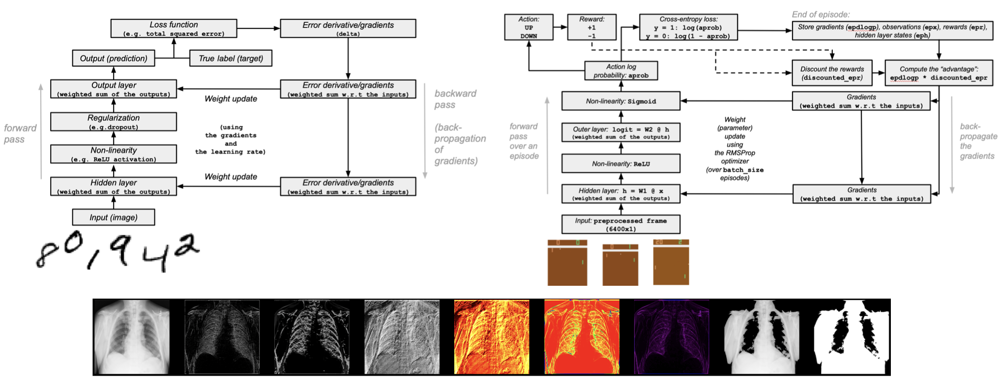

# Google Season of Docs 2020: NumPy - High level restructuring and end user focus

> Mentors: Melissa Mendonça, Matti Picus

_Main focus_: creating high-level NumPy developer documentation covering topics
that will benefit users and are missing from the official documentation.
Originally, the idea came from NumPy team's GSoD
[proposal](https://github.com/numpy/numpy/wiki/Google-Season-of-Docs-2020-Project-Ideas#project-idea-high-level-restructuring-and-end-user-focus).

_Background_: Given my experience with machine learning and numerical computing
frameworks, I primarily focused on tutorials covering deep learning,
reinforcement learning, and image pre-processing.

During the program, I received a lot of support and feedback from the mentors
including through biweekly NumPy documentation meetings with the team. I learned
a lot about structuring content with usability/user experience in mind. I
studied NumPy through
[tutorials](https://numpy.org/doc/stable/user/quickstart.html) and learned how
to become a better developer-writer by following
[Python](https://www.python.org/dev/peps/pep-0008/),
[Google](https://developers.google.com/style), and
[Microsoft](https://docs.microsoft.com/en-us/style-guide/welcome/) developer and
documentation style guides. I spent a significant amount of time researching
both [technical writing](https://developers.google.com/tech-writing) and the
topics covered in the docs. My research included reading through NumPy, SciPy
and Matplotlib API documentation, as well as studying research papers on arXiv
and biomedical publication sites. The links to the material can be found in all
tutorials to help the end users.

_Result_: With the assistance of NumPy's mentors, I contributed to the expansion
of NumPy documentation by creating three in-depth tutorials that will hopefully
help both new NumPy users and more experienced Pythonistas from diverse
backgrounds during their journey.

## Completed tutorials
 
1. **NumPy deep learning on MNIST from scratch**
   ([link](https://github.com/numpy/numpy-tutorials/pull/33)):

    - Demonstrating how to build a simple feedforward neural network and train it
      from scratch with NumPy to recognize handwritten digit images.
    - Motivation: helping new artificial intelligence (AI) enthusiasts understand
      how basic deep learning works using only NumPy; the recent advances in deep
      learning in various fields all across the world.
    - The tutorial was adapted from the work by Andrew Trask (DeepMind) (with the
      author's permission).
    - Python tools used: NumPy, Matplotlib.
    - Challenges: developing a good understanding of a backpropagation and how the
      learning works in a multi-layer perceptron) and then writing about it;
      creating a workaround for loading the MNIST dataset without an external
      library, simplifying some parts of the code (using NumPy); designing a
      diagram that shows how the learning works during neural network training;
      working without deep learning frameworks for Python (such as TensorFlow or
      PyTorch).

2. **NumPy deep reinforcement learning with Pong from pixels**
   ([link](https://github.com/numpy/numpy-tutorials/pull/35)):

    - Demonstrating how to implement a deep reinforcement learning (RL) agent from
      scratch using a policy gradient method that learns to play the Pong video
      game using screen pixels as inputs with NumPy.
    - Motivation: the recent advances in RL in video games, simulation,
      medicine, robotics, and neuroscience; helping new AI enthusiasts
      understand how deep RL works using NumPy.
    - The work is based on the code developed by Andrej Karpathy (Tesla) for the
      Deep RL Bootcamp in 2017 at UC Berkeley (attended in person).
    - Python tools used: NumPy, OpenAI Gym.
    - Challenges: developing an in-depth understanding of a simple policy gradient
      method in RL and writing about it; developing an RL glossary and summarizing
      the history to help the readers understand the field better; studying using
      various books, research papers, lectures (by UC Berkeley, OpenAI and
      DeepMind) on YouTube, and blog posts; explaining A. Karpathy's code in a way
      that would be more accessible to users who are new to the field (including
      through designing a diagram); working without deep learning frameworks for
      Python (such as TensorFlow or PyTorch).

3. **NumPy X-ray image processing**
   ([link](https://github.com/numpy/numpy-tutorials/pull/38)):

    - Teaching how to load the X-ray data (ChestXray-8), apply masks to images
      using NumPy, and use computer vision techniques, such as the Gaussian
      gradient, Laplacian-Gaussian, Sobel, and Canny filters for edge detection
      with the help of SciPy (a scientific computing library).
    - Motivation: X-ray image analysis can assist with data analysis and machine
      learning workflow (e.g. detection of pneumonia); images make up the vast
      majority of biomedical data.
    - Python tools used: NumPy, SciPy, imageio, and Matplotlib.
    - Challenges: finding an open source biomedical dataset; learning about
      computer vision techniques for biomedical data; working with Matplotlib.

## After Google Season of Docs

I'm continuing to work with the NumPy docs team and have discussed the following
ideas:

- A tutorial/how-to for working with audio data with NumPy.
- Automatic differentiation: building a small library with NumPy.
- Examples of NumPy and [JAX](https://github.com/google/jax) interoperability
  (JAX is a library for high-performance numerical computing by Google).
